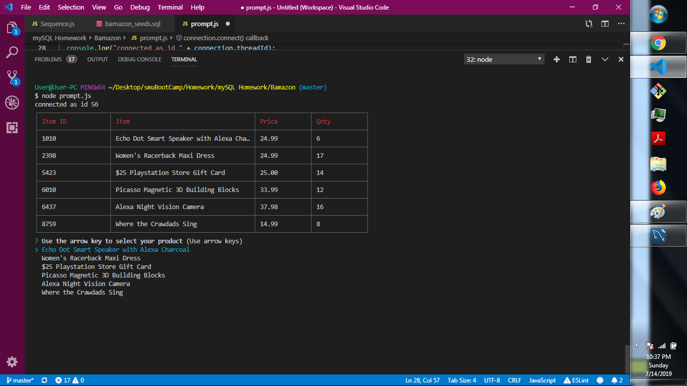
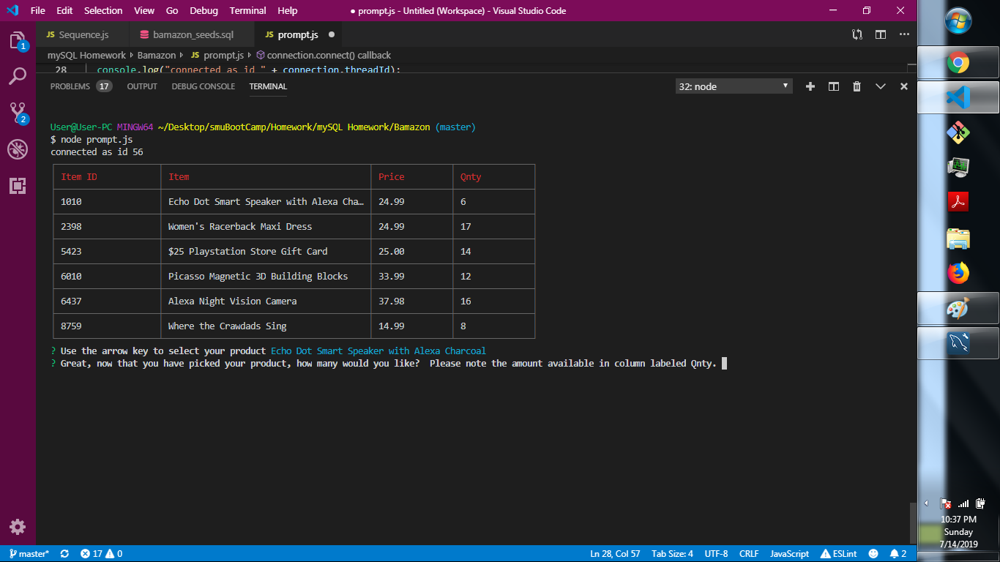
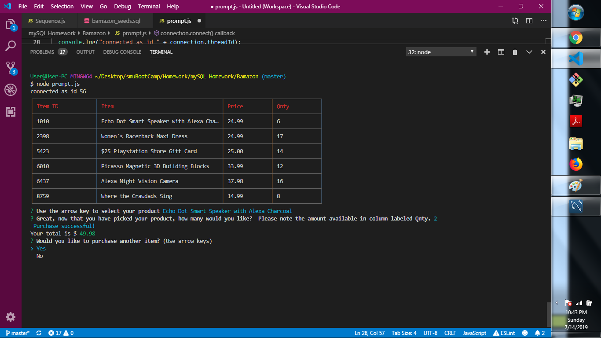
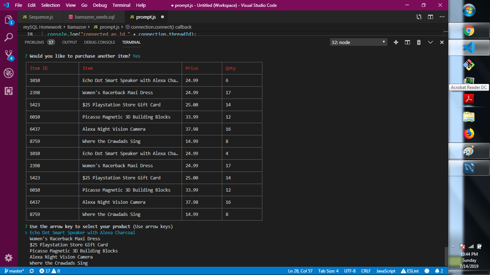
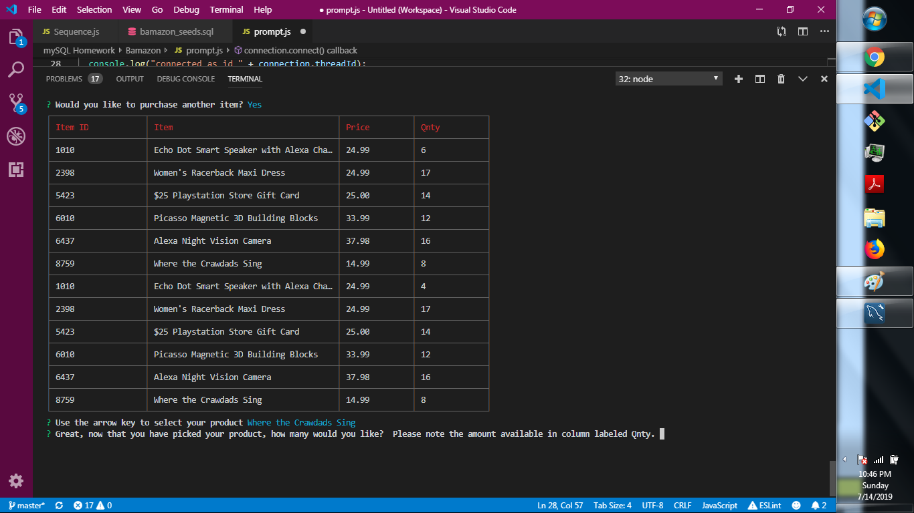
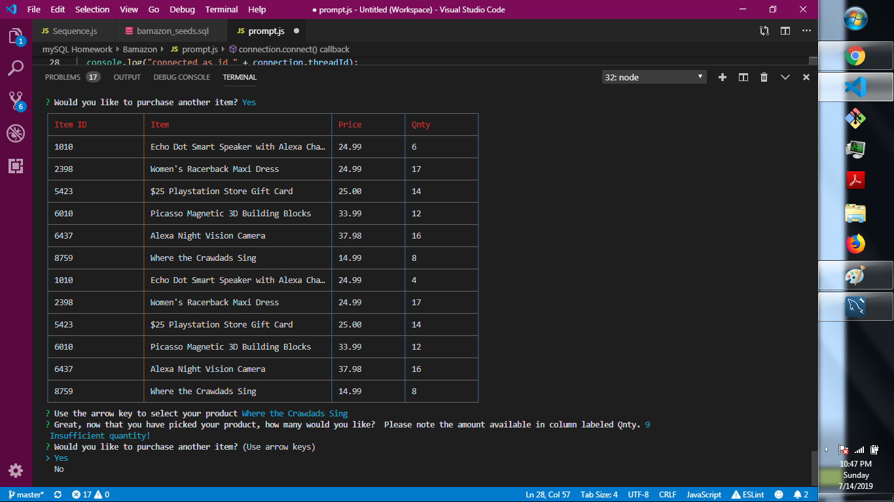

# Bamazon

Bamazon is an Amazon-like storefront that takes in orders from customers and depletes stock from the store's inventory.

<h2>Technologies Used</h2>
<ol>
<li>mySQL</li>
<li>javascript node application</li>
<li>inquirer, cli-table, and mysql npm packages</li>
</ol>

<h2>Screenshots</h2>

 The initial selection by using arrow keys

 Second prompt for user to add quantity after product selection

Purchase successful with total dollar amount message with option to purchase more

 When user chooses yes to purchase more from previous prompt then table displays updated inventory from their previous transaction.  Process is repeated for the user.

This frame leads to when the user chooses more quantity than available

Insufficient quantity message with option to pick again

