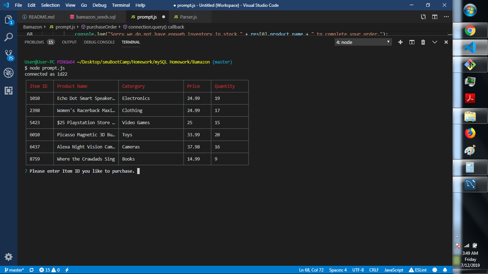

# Bamazon

Bamazon is an Amazon-like storefront that takes in orders from customers and depletes stock from the store's inventory.

<h2>Technologies Used</h2>
<ol>
<li>mySQL</li>
<li>javascript node application</li>
<li>inquirer, cli-table, and mysql npm packages</li>
</ol>

<h2>Screenshots</h2>

 The initial prompt for customer to add item number

 Second prompt for customer to request how many items desired

 When customer quantity request does not exceed inventory they receive a total cost and thank you message.

 However, when customer quantity request exceeds inventory they receive a message of 'out of stock' and given another chance to correct their selection/choose another item.

